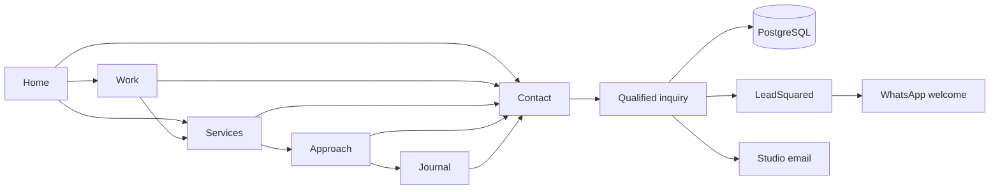

# Information Architecture & User Flows

## Product position
Parcel & Form India is a six-page studio platform for luxury developers, boutique brokerages, HNWIs and NRI stakeholders. It is not a property marketplace. The primary conversion is a qualified private studio inquiry; the secondary conversion is confidence built through work, capabilities and thought leadership.

All portfolio work and performance metrics in this repository are explicitly labeled as concept demonstrations. Production teams must replace them with approved claims and project-specific RERA details.

## Route map
| Route | Role | Primary audience question | Primary action |
|---|---|---|---|
| `/` | Flagship overview | “Can this studio make our development globally desirable?” | Explore work / inquire |
| `/work` | Evidence and depth | “Can they handle our market and asset class?” | Filter concepts / inspect spotlight |
| `/services` | Capability engine | “How will design and technology improve sales?” | Review capability matrix |
| `/approach` | Cultural and process confidence | “Will they understand Indian buyers and our design intent?” | Understand principles/process |
| `/journal` | Authority and organic acquisition | “Do they understand market shifts?” | Read topic summaries |
| `/contact` | Qualification and conversion | “Are we a fit, and how do we begin?” | Complete four-step inquiry |

System endpoints: `/api/inquire`, `/api/currency`, `/api/webhooks/whatsapp`, `/sitemap.xml`, `/robots.txt`, `/manifest.webmanifest`, and `/opengraph-image`.

## Navigation model
The global header exposes all six public routes. At widths under 1100px, navigation becomes a modal menu with focus containment, Escape support and scroll locking. The footer repeats the conversion action and opens a RERA/concept disclosure dialog.



## Priority user flows
### NRI investor-experience decision maker
1. Lands on Home through a referral or campaign.
2. Reads India/global value proposition and illustrative proof rail.
3. Opens Work and filters Goa/Mumbai/Estates.
4. Inspects Vastu and currency demonstrations.
5. Opens Services to validate WhatsApp, CRM and multi-currency capability.
6. Completes Contact with NRI status selected.
7. API assigns `NRI`; qualifying budgets also receive `PREMIUM-DESK`.

### Luxury developer / marketing head
1. Lands on a Journal or Services route from search.
2. Validates domain depth and platform stack.
3. Reviews Work by region/asset class.
4. Reads twelve-week delivery rhythm on Approach.
5. Submits project type, GDV, market and timeline.
6. Lead persists before external integrations; CRM failure does not discard it.

## Component architecture
Server Components remain the default. Client JavaScript is limited to stateful or browser-dependent islands.

```text
app/layout.tsx
├── SiteHeader (client: route state, menu focus trap)
├── JsonLdScript (server)
├── route page (server)
│   ├── PageHero (server + next/image)
│   ├── ProjectCard (server)
│   ├── Reveal (client: IntersectionObserver)
│   ├── WorkFilter (client)
│   ├── CurrencyToggle (client demonstration)
│   ├── VastuFloorplanViewer (client)
│   └── MultiStepForm (client)
└── SiteFooter (server)
    └── RERAFooterModal (client)
```

Required reusable contracts:
- `<ProjectCard project priority />`: typed project presentation with media, metric and disclosure.
- `<RERAFooterModal />`: keyboard-accessible legal/context disclosure.
- `<MultiStepForm />`: guarded state machine and API submission.
- `<CurrencyToggle crores />`: INR/USD/AED demonstration; production UI should consume `/api/currency`.
- `<VastuFloorplanViewer />`: progressive floor/Vastu overlay with architect-approval disclaimer.

## Contact form state machine
States: `PROPERTY_TYPE → BUDGET → LOCATION → CONTACT → SUBMITTING → SUCCESS | ERROR`.

| State | Required data / guard | Events | Next state |
|---|---|---|---|
| `PROPERTY_TYPE` | `propertyType` is selected | `SELECT`, `CONTINUE` | `BUDGET` |
| `BUDGET` | category selected; slider 10–500 | `SELECT`, `CHANGE_GDV`, `BACK`, `CONTINUE` | `LOCATION` |
| `LOCATION` | `locationFocus` is selected | `SELECT`, `BACK`, `CONTINUE` | `CONTACT` |
| `CONTACT` | valid name/email/phone; consent true | `CHANGE`, `BACK`, `SUBMIT` | `SUBMITTING` |
| `SUBMITTING` | submission lock prevents duplicates | `RESOLVE`, `REJECT` | `SUCCESS` or `ERROR` |
| `ERROR` | server-safe error shown | `CHANGE`, `RETRY` | `CONTACT`/`SUBMITTING` |
| `SUCCESS` | inquiry identifier exists | `RESET` | `PROPERTY_TYPE` |

`BACK` never clears previously supplied data. Option selection can advance after a short visual acknowledgement. The server is authoritative: strict Zod validation, payload cap, origin enforcement, shared rate limit and honeypot apply regardless of client guards.

### Submission JSON contract
```json
{
  "propertyType": "Boutique Villas",
  "budgetCategory": "₹50 Cr – ₹250 Cr",
  "budgetCrores": 120,
  "locationFocus": "Goa",
  "name": "Example Decision Maker",
  "email": "decision.maker@example.com",
  "countryCode": "+971",
  "phone": "501234567",
  "nriStatus": true,
  "projectTimeline": "Q3/Q4 2026",
  "projectOfInterest": "Confidential North Goa estate",
  "consent": true,
  "companyWebsite": "",
  "utmSource": "private-referral"
}
```

## Metadata contract
`content/site.json` is the single source for navigation and route metadata; `content/site.schema.json` is the exact JSON Schema. `lib/site-config.ts` maps each page object to Next.js title, description, canonical URL, Open Graph and Twitter metadata. Adding a public route requires schema, JSON configuration, sitemap and navigation review.

## RERA information architecture
For a production property project, every project route/card must resolve to an immutable compliance object: registration number, state authority URL, promoter legal name, registered project name, approvals, disclaimer version and last-reviewed timestamp. Do not source RERA data from marketing copy. Display it near price/inventory and repeat it in the legal modal/footer. This demo intentionally avoids real listing claims.
